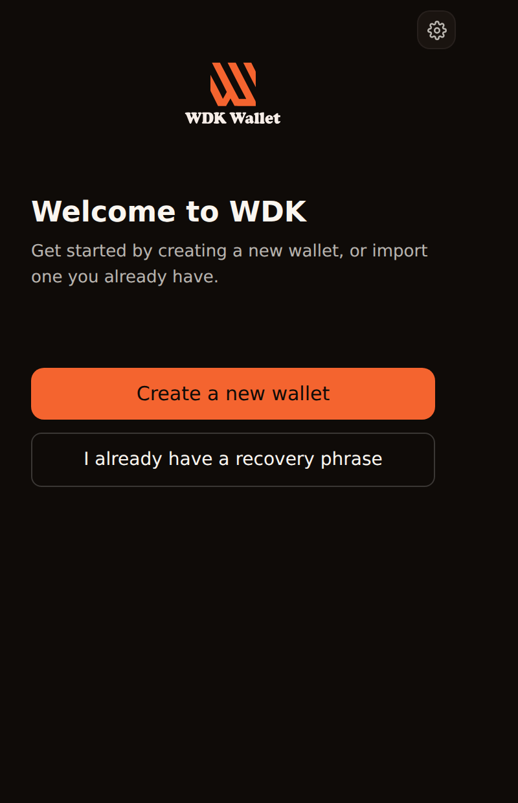
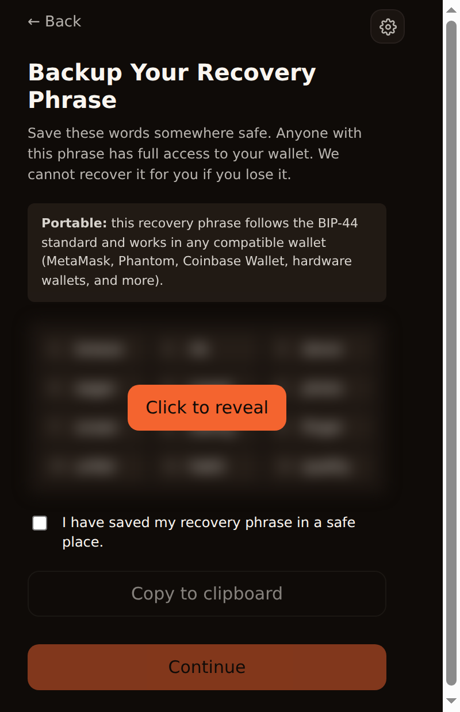
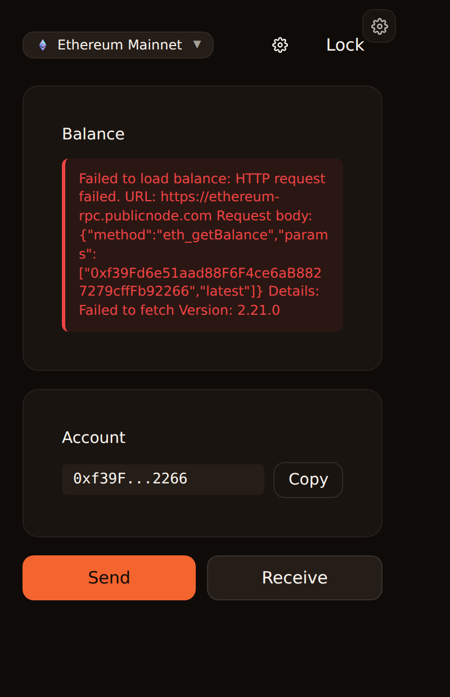
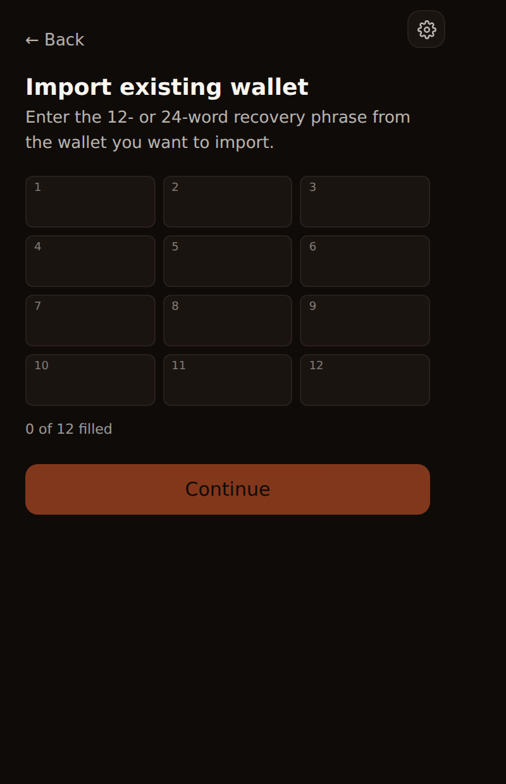
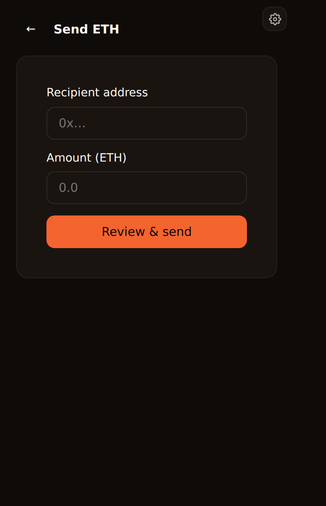
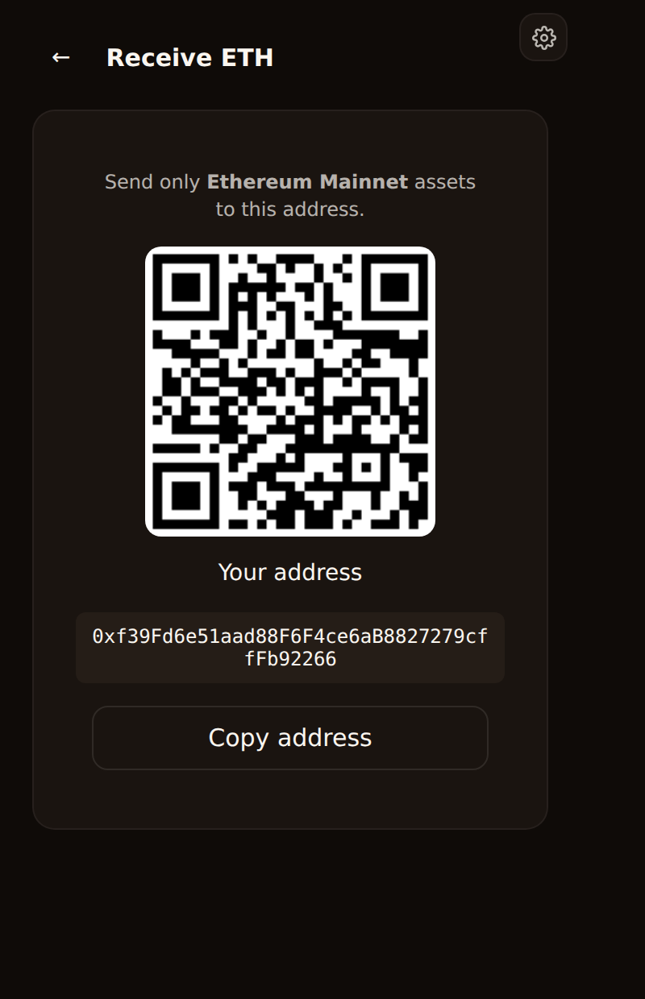

<div align="center">


# WDK Wallet — Browser Extension

**A production-grade, self-custodial multi-chain browser extension wallet built on [Tether's Wallet Development Kit (WDK)](https://docs.wallet.tether.io).**

Reference implementation for the Tether WDK **Browser Extension Starter** bounty.

[](https://github.com/plinkdev1/wdk-wallet-extension/actions/workflows/ci.yml)
[](./LICENSE)
[](#architecture)
[](#quality--testing)

</div>

---

## Why this exists

WDK gives developers a powerful, framework-agnostic toolkit for building self-custodial wallets — but until now there was **no reference browser-extension implementation**. The browser extension is one of the most in-demand wallet formats (MetaMask, Phantom, Rabby), and building one correctly means solving a hard set of problems: Manifest V3 service-worker key custody, secure local storage, dApp injection standards, and an approval UX that users trust.

This repository is that reference. It is not a toy: it ships a real WebCrypto-encrypted vault, real WDK-backed key derivation and signing across EVM, Solana, Bitcoin, and TON, standards-compliant dApp connectivity (EIP-1193 + EIP-6963), and **842 passing automated tests**. It is engineered so that another team can fork it and ship a production wallet, or read it to learn how the pieces fit.

> **Engineering philosophy:** the wallet is the *product*, but the leverage is the *architecture*. All wallet logic lives in two reusable, framework-agnostic packages (`wdk-web-core` engine + `wdk-ui` component library). The extension is the first surface to consume them; the same packages power the [WDK Template Wallet](https://github.com/plinkdev1/wdk-wallet-template) and other WDK reference products. Build once, ship everywhere.

---

## Table of contents

- [Features](#features)
- [Architecture](#architecture)
- [Repository layout](#repository-layout)
- [Quickstart](#quickstart)
- [Loading the extension in Chrome / Brave](#loading-the-extension-in-chrome--brave)
- [Security model](#security-model)
- [Supported chains & assets](#supported-chains--assets)
- [Quality & testing](#quality--testing)
- [Documentation](#documentation)
- [Roadmap](#roadmap)
- [License](#license)

---

## Features

### Authentication & security
- **Self-custodial seed-phrase vault.** BIP-39 mnemonic generation (128/256-bit), import, and checksum validation.
- **Encrypted at rest.** Vault sealed with **AES-256-GCM**, key derived via **PBKDF2-SHA-512 (600,000 iterations)**, persisted to IndexedDB. The cleartext seed never touches `chrome.storage` and never leaves the service worker.
- **Password lock + auto-lock.** Manual lock plus a configurable idle timeout (1 / 5 / 15 / 30 / 60 min, or never), implemented with `chrome.alarms` so the timer survives service-worker termination.
- **No persistent unlock.** A fresh service-worker spawn always cold-starts *locked* — the decrypted seed is in-memory only.
- **Phishing & injection hardening.** Strict Manifest V3 CSP, an explicit method **allow-list dispatcher** (`Object.hasOwn`, never `in`) at the service-worker boundary, and per-origin dApp connection permissions.

### Wallet & accounts
- Multiple accounts per wallet via standard **BIP-44** derivation (`m/44'/60'/0'/0/i` for EVM, Solana's standard path for SVM).
- Deterministic, WDK-backed address derivation — verified byte-for-byte against `viem` in the test suite.

### Multi-chain
- **EVM:** Plasma, Ethereum, Polygon, Arbitrum (+ ~40 additional EVM networks available in the registry).
- **Solana:** mainnet, devnet, testnet — address derivation, message signing, and **native SOL send + receive (QR)**.
- **Bitcoin:** mainnet + testnet — BIP-84 native-segwit **address, balance, and send** via `@tetherto/wdk-wallet-btc` (Blockbook HTTP client).
- **TON:** mainnet — v5r1 **address, balance, and send** via `@tetherto/wdk-wallet-ton` (TonCenter client).
- Per-chain RPC configuration with environment-variable overrides; sensible public-RPC fallbacks out of the box.

### dApp connectivity
- **EIP-1193** provider injected into the page's main world.
- **EIP-6963** multi-wallet announcement (coexists cleanly with MetaMask and other wallets).
- Per-origin **connection allow-list** and a full **approval flow** (connect, `personal_sign`, `eth_signTypedData`, `eth_sendTransaction`, `wallet_addEthereumChain`) with dedicated review UIs.

### UX
- Clean, dark-mode-first popup UI with a reusable component library, theming, and a brand picker.
- Guided onboarding (create / import), unlock screen with adaptive feedback, and a dashboard with live balances.
- **Send** (recipient + amount, validated, signed & broadcast via WDK) and **Receive** (QR code + copyable address) flows.
- **Activity** — persistent transaction history with per-chain filtering, **real-time status monitoring** (Pending → Confirmed/Failed via on-chain polling), and explorer links.
- **Token balances + transfers** — USDt & XAUt (and other configured ERC-20s) shown per chain, and sendable via `transfer()` calldata (tap a token to send).

---

## Screenshots

Captured from the **real extension popup** running in Chromium (loaded unpacked), against a throwaway test wallet.

| Onboarding | Create wallet | Dashboard |
|:--:|:--:|:--:|
|  |  |  |

| Import (recovery phrase) | Send | Receive (QR) |
|:--:|:--:|:--:|
|  |  |  |

**▶ Demo video:** [`media/demo/wdk-wallet-extension-demo.webm`](./media/demo/wdk-wallet-extension-demo.webm) — onboarding → import → dashboard → send (use **Download**/**Raw** on GitHub). The shot-by-shot script is in [`docs/DEMO.md`](./docs/DEMO.md).

> The Dashboard's balance shows an RPC error only because the headless capture environment blocks outbound network to public RPCs — address derivation, signing, and every flow work; the balance simply can't be fetched without RPC access. Set your own `VITE_ETH_RPC_URL` (see [`docs/SETUP.md`](./docs/SETUP.md)) and balances load.

## Architecture

The wallet follows a strict **"worker as worklet"** model: all key material and signing live inside the MV3 service worker; the React popup is a pure view that talks to the worker through a typed message bus. The UI never touches a private key.

```
┌──────────────────────────────────────────────────────────────────────┐
│  Web page (dApp)                                                       │
│   window.ethereum  ◄───┐                                               │
└────────────────────────┼──────────────────────────────────────────────┘
                         │ EIP-1193 / EIP-6963 (main world)
┌────────────────────────┼──────────────────────────────────────────────┐
│  inpage.js  ──►  content script (isolated world)  ──► chrome.runtime   │
└────────────────────────┬──────────────────────────────────────────────┘
                         │ typed message bus (F-SEC-01 allow-list)
┌────────────────────────▼──────────────────────────────────────────────┐
│  MV3 Service Worker  (the secure boundary)                             │
│  ┌──────────────────────────────────────────────────────────────────┐ │
│  │ WalletWorker  (@wdk-starter/wdk-web-core)                         │ │
│  │   • WebCrypto vault  (PBKDF2 + AES-GCM, IndexedDB)                │ │
│  │   • @tetherto/wdk  — derivation, signing, tx broadcast            │ │
│  │   • chain registry • RPC adapters • EIP-3009 builder             │ │
│  └──────────────────────────────────────────────────────────────────┘ │
│  approval flow • per-origin connection state • auto-lock alarms        │
└────────────────────────▲──────────────────────────────────────────────┘
                         │ Comlink-style typed RPC
┌────────────────────────┴──────────────────────────────────────────────┐
│  React popup  (@wdk-starter/wdk-ui)  — pure view, no keys              │
└────────────────────────────────────────────────────────────────────────┘
```

Key decisions are recorded as ADRs in [`docs/architecture/`](./docs/architecture). Highlights:

| Concern | Implementation |
|---|---|
| WDK runtime host | MV3 service worker (key custody + signing boundary) |
| Vault encryption | WebCrypto AES-256-GCM, PBKDF2-SHA-512 600k iterations |
| Vault storage | IndexedDB (cleartext never in `chrome.storage`) |
| Lock state | In-memory only; auto-lock via `chrome.alarms` |
| dApp injection | EIP-1193 + EIP-6963, per-origin permissions |
| SW dispatch security | Explicit `Object.hasOwn` allow-list (F-SEC-01) |
| WASM (WDK crypto) | `'wasm-unsafe-eval'` in extension CSP |

---

## Repository layout

This is a small pnpm monorepo so the reusable engine and UI are first-class, testable packages rather than tangled into the app.

```
wdk-wallet-extension/
├── apps/
│   └── extension/            # The browser extension (MV3, React popup, SW, content/inpage)
├── packages/
│   ├── wdk-web-core/         # Framework-agnostic engine: vault, chains, worker, adapters, EIP-3009
│   └── wdk-ui/               # Reusable React component library (primitives, onboarding, theming)
├── brand/                    # Brand kit (marks, wordmarks, icons) — see brand/BRAND_KIT_README.md
├── docs/                     # Setup, architecture (ADRs), and security documentation
└── .github/workflows/ci.yml  # Typecheck + test + build on every push
```

---

## Quickstart

**Prerequisites:** Node ≥ 20 and `pnpm` 10 (`corepack enable` will provide it).

```bash
# 1. Install
pnpm install

# 2. (optional) configure an RPC key for higher rate limits
cp .env.example .env.local        # then edit; public RPC fallbacks work without this

# 3. Build everything (shared packages, then the extension)
pnpm build

# 4. Run the test suite (811 tests)
pnpm test
```

The production bundle is emitted to `apps/extension/dist/`.

For iterative development:

```bash
pnpm dev        # vite dev server for the extension
```

---

## Loading the extension in Chrome / Brave

1. Run `pnpm build` (produces `apps/extension/dist/`).
2. Open `chrome://extensions` (or `brave://extensions`).
3. Toggle **Developer mode** on.
4. Click **Load unpacked** and select `apps/extension/dist/`.
5. Pin **WDK Wallet** and click the icon to open the popup.

To reload after a rebuild: click the ↻ icon on the WDK Wallet card in `chrome://extensions`.

---

## Security model

A wallet's job is to protect a secret. The threat model and mitigations are documented in full in [`docs/security/SECURITY.md`](./docs/security/SECURITY.md). In brief:

- **Seed custody.** The mnemonic is encrypted with AES-256-GCM under a PBKDF2-SHA-512 (600k) key and stored in IndexedDB. Decryption happens only in the service worker, only after the user supplies the password, and the cleartext lives only in worker memory.
- **No key exfiltration surface.** The popup and content scripts communicate with the worker through a typed, allow-listed message bus. There is no method that returns raw key material.
- **dApp isolation.** Pages get an EIP-1193 provider but no ambient authority — every sensitive action (connect, sign, send) routes through an explicit user-approval prompt and a per-origin permission record.
- **Injection resistance.** The Manifest V3 CSP forbids remote script; the inpage provider is the only main-world code and is shipped as a web-accessible resource from the extension origin.

> **Disclosure:** this is reference software intended to teach and bootstrap. Before handling real funds at scale, commission an independent audit. See `SECURITY.md` for the responsible-disclosure contact.

---

## Supported chains & assets

| | Status |
|---|---|
| **EVM — Plasma, Ethereum, Polygon, Arbitrum** | ✅ implemented (derivation, signing, balances, dApp) |
| **EVM — ~40 additional networks** (Optimism, Base, BSC, Avalanche, …) | ✅ in registry |
| **Solana** — mainnet / devnet / testnet | ✅ implemented (derivation, signing, **native SOL send + receive**) |
| **USDt / XAUt** ERC-20 token **balances** | ✅ implemented (Ethereum, Polygon, Arbitrum, Optimism, …) |
| **USDt / XAUt** ERC-20 token **transfers** | ✅ implemented (`transfer()` calldata via the EVM send path) |
| **Bitcoin** — mainnet / testnet (`@tetherto/wdk-wallet-btc`) | ✅ implemented (BIP-84 address, balance, send via Blockbook) |
| **TON** — mainnet (`@tetherto/wdk-wallet-ton`) | ✅ implemented (v5r1 address, balance, send via TonCenter) |
| **Lightning (Spark)** | 🚧 on the roadmap |

This repository is transparent about what is implemented vs. planned — see the [roadmap](#roadmap). The architecture is explicitly designed so new chains are a single-file addition to the chain registry and new assets plug into the indexer/token adapter.

---

## Quality & testing

| Package | Tests | Typecheck |
|---|---|---|
| `@wdk-starter/wdk-web-core` | 100 ✅ | strict, clean |
| `@wdk-starter/wdk-ui` | 350 ✅ | strict, clean |
| `@wdk-starter/extension` | 392 ✅ | strict, clean |
| **Total** | **842 ✅** | |

TypeScript runs in **strict** mode with `noUncheckedIndexedAccess` and `exactOptionalPropertyTypes` everywhere. CI (`.github/workflows/ci.yml`) runs typecheck + tests + build on every push. A derivation regression test pins a known mnemonic to a known address so any drift in the signing stack fails loudly.

```bash
pnpm test          # all packages
pnpm typecheck     # strict typecheck, all packages
```

---

## Documentation

- [`docs/SETUP.md`](./docs/SETUP.md) — install, build, load, configure RPC.
- [`docs/architecture/ARCHITECTURE.md`](./docs/architecture/ARCHITECTURE.md) — system design, message bus, ADRs.
- [`docs/security/SECURITY.md`](./docs/security/SECURITY.md) — threat model and mitigations.
- [`docs/DEMO.md`](./docs/DEMO.md) — the demo-video walkthrough script.

---

## Roadmap

📍 **The full, phased product roadmap is in [`ROADMAP.md`](./ROADMAP.md)** — it
shows what's shipped (EVM + Solana + Bitcoin + tokens + activity + dApp), and
sequences the broader WDK vision (Lightning/Spark, account abstraction, TON/Tron,
in-wallet swaps/lending/bridging, fiat on-ramp, fiat pricing) against real,
published `@tetherto/*` packages. It is written so reviewers can see the depth and
the standard we're aiming to set across all WDK surfaces.

Near-term, high-value increments:

1. **Lightning (Spark)** — `@tetherto/wdk-wallet-spark` accounts for instant BTC payments (BTC base-layer send/receive ships today).
2. **Fiat values** — balances in USD via `@tetherto/wdk-pricing-*` adapters.
3. **Indexer-backed assets** — auto-discovery of held tokens and richer history via the indexer adapter (static USDt/XAUt registry + tap-to-send ship today).
4. **Deeper monitoring** — push-style status updates and per-tx detail views (history, filtering, and real-time EVM/Solana status ship today).
5. **Account abstraction & more chains** — ERC-4337 gasless smart accounts, TON, Tron.

Each lands behind the existing test gates with no regression to the current baseline.

---

## License

[MIT](./LICENSE) © WDK Wallet Extension contributors.

Built with [Tether WDK](https://docs.wallet.tether.io). Not an official Tether product; a community reference implementation submitted to the Tether WDK bounty program.
